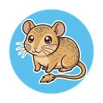
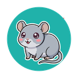
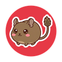
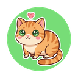

# HALT Bot

A general-purpose Discord bot built for [Helping All Little Things](https://helpingalllittlethings.org).

HALT Bot currently features two main modules:
1. **HALT Go**: A simultaneous multiplayer card drafting game with adorable rescue animals (inspired by Sushi Go!).
2. **Fundraiser System**: A built-in donation tracking system with visual thermometer graphics and admin verification.

---

## 1. HALT Go (Minigame)

Players join a lobby, then draft adorable animal cards over **3 rounds** of **7 phases** each. All players pick at the same time via DMs — no waiting for turns! After each round, scores are automatically calculated based on card combinations. The player with the highest score after 3 rounds wins, and every player receives a personalized **collectible gallery** image showing all the cards they collected.

### Card Types

| Card | Scoring | Strategy |
|------|---------|----------|
| Rat | Scaling set: 1=1, 2=3, 3=6, 4=10, 5+=15 pts | High reward for collecting many; caps at 5 |
| Gerbil | Majority bonus: Most=+6, 2nd=+3 pts | Compete for the most across all players |
| Pregnant Hamster | Swap this card for 2 new random cards | Gamble: lose 1 known card, gain 2 random |
| Hay | Triples the value of the next Guinea Pig, Rabbit, or Chinchilla | Best combo: Hay + Guinea Pig = 9 pts |
| Guinea Pig | 3 points each (9 with Hay) | Reliable points, excellent Hay target |
| Rabbit | 2 points each (6 with Hay) | Solid mid-tier value |
| Chinchilla | 1 point each (3 with Hay) | Common, low value alone |
| Degu | Set of 3 = 10 points, otherwise 0 | All-or-nothing: commit to 3 or skip |
| Sanctuary Cat | End-game: Most=+6, Least=-6 | Scored after all 3 rounds combined |

### How to Play

1. Someone uses `/game` to create a lobby
2. Other players click **Join Game** (2-10 players)
3. (Optional) The host can click the **Computer** button to toggle HALTbot, a computer opponent that picks cards randomly.
4. The host clicks **Start Game** when everyone is ready
5. Each phase, check your **DMs** for card choices displayed as images
6. Click a button to pick your card (60-second timer, auto-selects if you don't pick)
7. After all 7 phases, round scores are shown in the channel
8. After 3 rounds, final scores (including Sanctuary Cat bonuses) determine the winner

**Important:** Players must have DMs enabled for the server. In Discord: right-click the server icon > **Privacy Settings** > enable **Direct Messages**.

---

## 2. Fundraiser System (Optional)

HALT Bot includes a built-in fundraiser system that lets your community donate to a cause and track progress with a visual thermometer graphic. The fundraiser supports three donation methods:

- **PayPal** — Users click a link to donate directly via `/donate`. If PayPal webhooks are configured, donations are **automatically detected and recorded** when the payment completes.
- **CashApp** — Users send money via CashApp, then self-report with `/donated <amount>`. Admins verify pending donations with `/confirm` or `/deny`.
- **Patreon** — Users sign up on Patreon, then self-report their pledge with `/patron <pledge> [extra]`. Admins verify with `/confirmpatron`. If Patreon webhooks are configured, new pledges are tracked automatically. The fundraiser tracks both a **dollar goal** and a **Patreon patron count goal**.

When a donation is recorded (automatically via PayPal webhook or manually confirmed by an admin), the bot posts a celebration announcement with a thermometer progress graphic in the configured announcement channel.

### PayPal Auto-Tracking (Optional)

By default, the `/donate` command simply opens a PayPal link. To **automatically track** PayPal donations, you can configure PayPal webhooks. This requires:

1. A PayPal REST API app (free to create at [developer.paypal.com](https://developer.paypal.com/dashboard/applications))
2. A publicly accessible HTTPS URL for your server (use a reverse proxy or tunnel like ngrok/Cloudflare Tunnel)
3. Three additional `.env` variables: `PAYPAL_CLIENT_ID`, `PAYPAL_CLIENT_SECRET`, and `PAYPAL_WEBHOOK_ID`

See the [PayPal Webhook Setup](#paypal-webhook-setup) section below and [FUNDRAISER.md](FUNDRAISER.md) for full details.

For complete documentation on the fundraiser system, commands, and dashboard, see [FUNDRAISER.md](FUNDRAISER.md).

---

## 3. Commands

| Command | Module | Description |
|---------|--------|-------------|
| `/game` | Game | Create a new game lobby in the current channel |
| `/help` | Game | View the rules and card descriptions |
| `/status` | Game | Check the status of the current game |
| `/donate` | Fundraiser | Show donation options for the active fundraiser |
| `/fundraiser` | Fundraiser | Check the current fundraiser progress with thermometer graphic |
| `/donated <amount>` | Fundraiser | Report a CashApp donation for admin verification |
| `/patron <pledge> [extra]` | Fundraiser | Report a new Patreon signup for admin verification |
| `/confirm <id>` | Fundraiser | Admin: Confirm a pending CashApp donation |
| `/deny <id>` | Fundraiser | Admin: Deny a pending CashApp donation |
| `/confirmpatron <id>` | Fundraiser | Admin: Confirm a pending Patreon pledge |
| `/denypatron <id>` | Fundraiser | Admin: Deny a pending Patreon pledge |
| `/pending` | Fundraiser | Admin: View all pending donations and pledges |

---

## 4. Setup & Installation

### Requirements

- **Node.js** v18 or later
- **pnpm** (recommended) or npm
- A Discord bot application

This project uses **@napi-rs/canvas** for rendering card images in Discord. It ships pre-built binaries for macOS, Linux, and Windows — no extra system dependencies needed.

### Step 1: Create a Discord Application

1. Go to the [Discord Developer Portal](https://discord.com/developers/applications)
2. Click **New Application** and name it "HALT Bot"
3. Go to the **Bot** tab and click **Reset Token** — copy and save this token (this is your `DISCORD_TOKEN`)
4. Under **Privileged Gateway Intents**, enable **Message Content Intent**
5. Go to the **OAuth2** tab:
   - Copy the **Client ID** (this is your `CLIENT_ID`)
   - Click **Reset Secret** and copy the Client Secret (this is your `CLIENT_SECRET`, needed for the settings dashboard)
   - Under **Redirects**, click **Add Redirect** and enter: `http://localhost:3000/auth/callback` (or your production URL)
   - Click **Save Changes**

### Step 2: Invite the Bot to Your Server

1. Still on the **OAuth2** page, scroll to **OAuth2 URL Generator**
2. Under **Scopes**, check **bot** and **applications.commands**
3. Under **Bot Permissions**, check:
   - Send Messages
   - Embed Links
   - Attach Files
   - Use Slash Commands
   - Read Message History
4. Copy the generated URL and open it in your browser to invite the bot to your server

### Step 3: Get Required Discord IDs

You will need a few IDs for your `.env` file. First, enable Developer Mode in Discord: **User Settings > App Settings > Advanced > Developer Mode**.

- **Guild ID**: Right-click your server name > **Copy Server ID**
- **Admin Role ID**: Go to Server Settings > Roles, right-click your admin role > **Copy Role ID**
- **Channel ID**: Right-click the channel where you want fundraiser announcements > **Copy Channel ID**

### Step 4: Install and Configure

```bash
# Clone the repository
git clone https://github.com/AlannaBurke/halt-discord-game.git
cd halt-discord-game

# Install dependencies
pnpm install

# Copy the environment file
cp .env.example .env
```

Edit `.env` with your values. Here is exactly where to get each value:

```env
# ============================================================
# Core Bot Settings
# ============================================================
# DISCORD_TOKEN: From Discord Developer Portal > Bot > Reset Token
DISCORD_TOKEN=your_bot_token

# CLIENT_ID: From Discord Developer Portal > OAuth2 > Client ID
CLIENT_ID=your_client_id

# GUILD_ID: Right-click your server name in Discord > Copy Server ID
# (Used to register slash commands instantly instead of waiting 1 hour)
GUILD_ID=your_guild_id

# ============================================================
# Settings Dashboard (Optional)
# ============================================================
# SETTINGS_ENABLED: Set to "true" to enable the web dashboard
SETTINGS_ENABLED=true

# CLIENT_SECRET: From Discord Developer Portal > OAuth2 > Client Secret
CLIENT_SECRET=your_client_secret

# SETTINGS_ADMIN_ROLE_ID: Right-click your admin role in Discord > Copy Role ID
# Only users with this role can log into the dashboard
SETTINGS_ADMIN_ROLE_ID=your_role_id

# SETTINGS_PORT: Port for the web server (default: 3000)
SETTINGS_PORT=3000

# SETTINGS_REDIRECT_URI: Must exactly match the redirect URI in Developer Portal
SETTINGS_REDIRECT_URI=http://localhost:3000/auth/callback

# SESSION_SECRET: Any random string for securing web sessions
SESSION_SECRET=any-random-string-here

# ============================================================
# Fundraiser System (Optional)
# ============================================================
# FUNDRAISER_ENABLED: Set to "true" to enable the /donate commands
FUNDRAISER_ENABLED=true

# FUNDRAISER_GOAL_AMOUNT: The target amount in dollars (e.g., 500)
FUNDRAISER_GOAL_AMOUNT=500

# FUNDRAISER_GOAL_LABEL: Title shown on the thermometer graphic
FUNDRAISER_GOAL_LABEL=HALT Fundraiser

# FUNDRAISER_PAYPAL_LINK: PayPal payment link (business donation page or paypal.me)
FUNDRAISER_PAYPAL_LINK=https://www.paypal.com/ncp/payment/YOUR_BUTTON_ID

# FUNDRAISER_CASHAPP_TAG: CashApp tag for manual donations
FUNDRAISER_CASHAPP_TAG=$YourCashTag

# FUNDRAISER_PATREON_LINK: Link to your Patreon creator page
FUNDRAISER_PATREON_LINK=https://www.patreon.com/YourPage

# FUNDRAISER_PATREON_PLEDGE_GOAL: Target number of patrons
FUNDRAISER_PATREON_PLEDGE_GOAL=50

# FUNDRAISER_ANNOUNCEMENT_CHANNEL_ID: Right-click channel > Copy Channel ID
# Where confirmed donation celebrations are posted
FUNDRAISER_ANNOUNCEMENT_CHANNEL_ID=your_channel_id

# ============================================================
# PayPal Webhook — Auto-Track Donations (Optional)
# ============================================================
# Without these, PayPal donations are not tracked automatically.
# See the PayPal Webhook Setup section below for instructions.

# PAYPAL_CLIENT_ID: From PayPal Developer Dashboard > Your App > Client ID
PAYPAL_CLIENT_ID=your_paypal_client_id

# PAYPAL_CLIENT_SECRET: From PayPal Developer Dashboard > Your App > Secret
PAYPAL_CLIENT_SECRET=your_paypal_client_secret

# PAYPAL_WEBHOOK_ID: From PayPal Developer Dashboard > Your App > Webhooks
PAYPAL_WEBHOOK_ID=your_webhook_id

# PAYPAL_MODE: "live" for production, "sandbox" for testing
PAYPAL_MODE=live
```

### Step 5: Deploy Commands and Start

```bash
# Register slash commands with Discord
pnpm run deploy

# Start the bot (and settings dashboard if enabled)
pnpm start
```

---

## 5. Webhook Setup (Optional)

### PayPal Webhooks

To automatically track PayPal donations (instead of only providing a donation link), follow these steps:

### Step A: Create a PayPal REST API App

1. Go to [developer.paypal.com/dashboard/applications](https://developer.paypal.com/dashboard/applications)
2. Click **Create App** and give it a name (e.g., "HALT Bot")
3. Copy the **Client ID** — this is your `PAYPAL_CLIENT_ID`
4. Click **Show** next to Secret and copy it — this is your `PAYPAL_CLIENT_SECRET`

### Step B: Set Up a Webhook

1. On the same app page, scroll to the **Webhooks** section
2. Click **Add Webhook**
3. Enter your webhook URL: `https://yourdomain.com/webhooks/paypal`
   - This must be HTTPS on port 443. If you're running locally, use a tunnel like [ngrok](https://ngrok.com) or [Cloudflare Tunnel](https://developers.cloudflare.com/cloudflare-one/connections/connect-networks/)
   - The path `/webhooks/paypal` is served by the settings dashboard (same Express server on `SETTINGS_PORT`)
4. Under **Events**, subscribe to: **PAYMENT.CAPTURE.COMPLETED**
5. Click **Save**
6. Copy the **Webhook ID** shown in the webhook list — this is your `PAYPAL_WEBHOOK_ID`

### Step C: Add to .env

```env
PAYPAL_CLIENT_ID=AaBbCcDd...
PAYPAL_CLIENT_SECRET=EeFfGgHh...
PAYPAL_WEBHOOK_ID=0NH55953DH663215D
PAYPAL_MODE=live
```

Restart the bot. You should see `💙 PayPal webhook endpoint active at /webhooks/paypal` in the console. When someone completes a PayPal payment, the bot will automatically record it and post an announcement.

### Patreon Webhooks

To automatically track new Patreon pledges (instead of relying on `/patron` self-reporting):

1. Go to [Patreon Webhooks Registration](https://www.patreon.com/portal/registration/register-webhooks)
2. Click **Add Webhook**
3. Set the URL to: `https://yourdomain.com/webhooks/patreon` (must be HTTPS)
4. Subscribe to the event: **members:pledge:create**
5. Save, then copy the Webhook Secret and add it to your `.env`:

```env
PATREON_WEBHOOK_SECRET=your_secret_here
```

---

## 6. Custom Discord Emojis (Optional)

HALT Bot includes custom emoji images for the HALT Go minigame. When uploaded to your server, the bot automatically detects them and uses them everywhere!

1. In Discord, go to **Server Settings** > **Emoji** > **Upload Emoji**
2. Upload each image from `assets/emojis/`. Ensure the filenames match exactly:

| Preview | File | Discord Name | Card | Color |
|---------|------|--------------|------|-------|
|  | `halt_rat.png` | `:halt_rat:` | Rat | Hot Pink |
|  | `halt_gerbil.png` | `:halt_gerbil:` | Gerbil | Sky Blue |
|  | `halt_hamster.png` | `:halt_hamster:` | Pregnant Hamster | Mint Green |
|  | `halt_hay.png` | `:halt_hay:` | Hay | Sunny Yellow |
|  | `halt_guineapig.png` | `:halt_guineapig:` | Guinea Pig | Coral Orange |
|  | `halt_rabbit.png` | `:halt_rabbit:` | Rabbit | Lavender Purple |
|  | `halt_chinchilla.png` | `:halt_chinchilla:` | Chinchilla | Teal |
|  | `halt_degu.png` | `:halt_degu:` | Degu | Crimson Red |
|  | `halt_cat.png` | `:halt_cat:` | Sanctuary Cat | Lime Green |

Restart the bot, and you should see `Loaded 9 custom emojis` in the console.

---

## 7. Settings Dashboard

HALT Bot includes a web-based settings dashboard (if `SETTINGS_ENABLED=true`). It features four pages:

- **How to Play**: Complete gameplay rules reference.
- **Card Manager**: Upload custom images for any of the 9 card types. The bot automatically regenerates the Discord-sized cards with frames, titles, and scoring text.
- **Fundraiser**: Configure the fundraiser, view live progress, approve/deny pending CashApp donations, and see recent donation history.
- **Setup Guide**: Step-by-step instructions for bot configuration.

---

## 8. Project Structure

```
halt-discord-game/
├── src/
│   ├── index.js                  # Bot entry point + settings server startup
│   ├── commands/                 # Slash command registration
│   ├── game/                     # HALT Go game engine
│   ├── fundraiser/               # Fundraiser engine & thermometer generation
│   ├── ui/                       # Discord embed builders & card rendering
│   ├── settings/                 # Express settings dashboard server
│   └── utils/                    # Constants & config
├── assets/
│   ├── cards/                    # Card art (original, custom, and Discord-sized)
│   └── emojis/                   # Custom Discord emoji images
├── test/                         # Core engine tests
├── .env.example                  # Environment variable template
├── GAME_DESIGN.md                # HALT Go game design document
├── FUNDRAISER.md                 # Fundraiser system documentation
├── ARCHITECTURE.md               # Technical architecture
├── package.json
└── README.md
```

## 9. Contributing & Support

Found a bug or have a feature idea? [Open an issue on GitHub](https://github.com/AlannaBurke/halt-discord-game/issues).

## License

MIT — Built with love for rescue animals everywhere.
